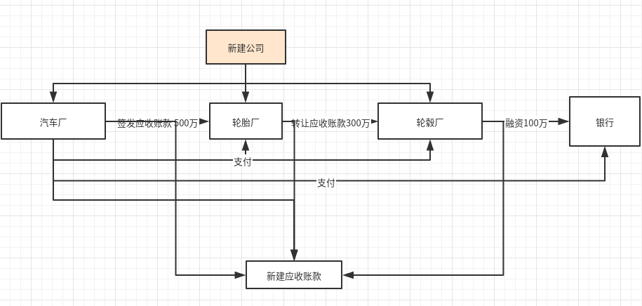
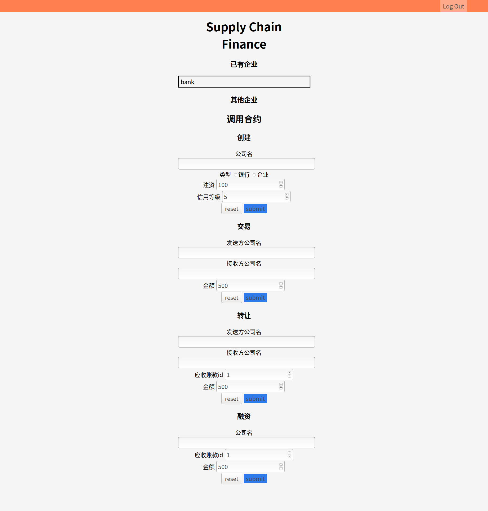

# 中山大学数据科学与计算机学院本科生实验报告

2019年秋季学期

课程名称：区块链原理与技术						任课教师： 郑子彬

16327109 谢昆成 软件工程

Email: xiekch@qq.com

github项目：[Supply-Chain-Finance](https://github.com/xiekch/Supply-Chain-Finance)

## 项目背景

某车企(宝马)因为其造车技术特别牛,消费者口碑好,所以其在同行业中占据绝对优势地位。因此,在金融机构(银行)对该车企的信用评级将很高,认为他有很大的风险承担的能力。在某次交易中,该车企从轮胎公司购买了一批轮胎,但由于资金暂时短缺向轮胎公司签订了 1000 万的应收账款单据,承诺 1 年后归还轮胎公司 1000 万。这个过程可以拉上金融机构例如银行来对这笔交易作见证,确认这笔交易的真实性。在接下里的几个月里,轮胎公司因为资金短缺需要融资,这个时候它可以凭借跟某车企签订的应收账款单据向金融结构借款,金融机构认可该车企(核心企业)的还款能力,因此愿意借款给轮胎公司。但是,这样的信任关系并不会往下游传递。在某个交易中,轮胎公司从轮毂公司购买了一批轮毂,但由于租金暂时短缺向轮胎公司签订了 500 万的应收账款单据,承诺 1 年后归还轮胎公司 500万。当轮毂公司想利用这个应收账款单据向金融机构借款融资的时候,金融机构因为不认可轮胎公司的还款能力,需要对轮胎公司进行详细的信用分析以评估其还款能力同时验证应收账款单据的真实性,才能决定是否借款给轮毂公司。这个过程将增加很多经济成本,而这个问题主要是由于该车企的信用无法在整个供应链中传递以及交易信息不透明化所导致的。

本项目将供应链上的每一笔交易和应收账款单据上链，同时引入第三方可信机构来确认这些信息的交易，例如银行，物流公司等，确保交易和单据的真实性。同时，支持应收账款的转让，融资，清算等，让核心企业的信用可以传递到供应链的下游企业，减小中小企业的融资难度。

## 方案设计

我们需要实现如下功能:

功能一:实现采购商品—签发应收账款 交易上链。例如车企从轮胎公司购买一批轮胎并签订应收账款单据。

功能二:实现应收账款的转让上链,轮胎公司从轮毂公司购买一笔轮毂,便将于车企的应收账款单据部分转让给轮毂公司。轮毂公司可以利用这个新的单据去融资或者要求车企到期时归还钱款。

功能三:利用应收账款向银行融资上链,供应链上所有可以利用应收账款单据向银行申请融资。

功能四:应收账款支付结算上链,应收账款单据到期时核心企业向下游企业支付相应的欠款。


### 存储设计

```
    uint receiptsSize;
    mapping(address => Company) public companies;
    mapping(uint => Receipt) public receipts;
```

通过mapping存储公司信息。

在合约内通过mapping将合约id（uint）映射到应收账款。每个合约id唯一。


### 数据结构

定义结构体应收账款Receipt

```c
    struct Receipt {
        address from;
        address to;
        uint amount;
        bool isValid;
    }
```

rate 表示信用评级。

Receipt[] public receipts`存储所有的应收账款。

定义结构体Company

```c
        struct Company {
        string name;
        uint balance;
        uint rate;
        uint toPay;
        uint toReceive;
        bool isBank;
        bool isValid;
    }
```

balance 为结余，rate为信用评级，toPay 表示应支付，toReceive表示应收款。

### 数据流图



每次签发应收账款、转让应收账款、融资和支付都会新建一笔应收账款。从而实现应收账款可拆分、可溯源。

### 核心功能介绍

- 新建企业

```c
    function newCompany(address com, string memory name, uint balance, uint rate) public{
        if(companies[com].isValid == true){
            emit resultEvent(0,0);
        }
        companies[com] = Company(name, balance, rate, 0, 0, false, true);
        emit resultEvent(1,0);
    }
```


- 实现采购商品—签发应收账款 交易上链。例如车企从轮胎公司购买一批轮胎并签订应收账款单据。

创建deal的调用者到`to`的应收账款。返回应收账款的id。

```c
        // send `to` a reciept after a deal
    function deal(address from, address to, uint amount) public returns (uint id) {
        if(companies[to].isValid == false){
            emit resultEvent(0,0);
        }

        if(companies[from].isValid == false){
            emit resultEvent(0,0);
        }
        companies[from].toPay += amount;
        companies[to].toReceive += amount;
        receiptsSize += 1;
        id = receiptsSize;
        receipts[id] = Receipt(from, to, amount, true);
        emit resultEvent(1,id);
    }
```


- 实现应收账款的转让上链，轮胎公司从轮毂公司购买一笔轮毂，便将于车企的应收账款单据部分转让给轮毂公司。轮毂公司可以利用这个新的单据去融资或者要求车企到期时归还钱款。

通过receiptId查出合法的应收账款。将原应收账款的amount减去转让的amount，创建新的应收账款，from为原应收账款的from。这样就将上层企业的应收账款分割开来，实现了信用传递。

```c
        // transfer account receivable from `from` to `to` with the `receiptId`
    function transfer(address from, address to, uint receiptId, uint amount) public returns (uint id) {
        if(companies[to].isValid == false){
            emit resultEvent(0,0);
        }

        if(companies[from].isValid == false){
            emit resultEvent(0,0);
        }

        if(receiptId > receiptsSize){
            emit resultEvent(0,0);
        }

        if(receipts[receiptId].to != from){
            emit resultEvent(0,0);
        }

        if(receipts[receiptId].amount < amount){
            emit resultEvent(0,0);
        }
        address upper = receipts[receiptId].from;
        receipts[receiptId].amount -= amount;

        companies[from].toReceive -= amount;
        companies[to].toReceive += amount;
        receiptsSize += 1;
        id = receiptsSize;
        receipts[id] = Receipt(upper, to, amount, true);
        emit resultEvent(1,id);
    }

```


-  利用应收账款向银行融资上链，供应链上所有可以利用应收账款单据向银行申请融资。

银行判断应收账款的from的信用评级。如果大于一个等级，则同意融资。

```c
    // finace from bank
    function financing(address to, address bank, uint receiptId, uint amount)public returns(bool success, uint id) {
        if(companies[to].isValid == false){
            emit resultEvent(0,0);
        }

        if(companies[bank].isValid == false){
            emit resultEvent(0,0);
        }

        if(receiptId > receiptsSize){
            emit resultEvent(0,0); 
        }

        if(receipts[receiptId].to != to){
            emit resultEvent(0,0);
        }

        if(receipts[receiptId].amount < amount){
            emit resultEvent(0,0);
        }
        // address to = msg.sender;
        address from = receipts[receiptId].from;
        companies[to].toReceive -= amount;
        companies[bank].toReceive += amount;

        receipts[receiptId].amount -= amount;
        companies[bank].balance -= amount;
        companies[to].balance += amount;
        receiptsSize += 1;
        id = receiptsSize;
        // a new receipt to bank
        receipts[id] = Receipt(from, bank, amount, true);
        success = true;
        emit resultEvent(1,id);
    }
```


- 应收账款支付结算上链，应收账款单据到期时核心企业向下游企业支付相应的欠款。

核心企业调用pay，向下游企业或者银行支付欠款。将原有应收账款的amount置0.

```c
        // pay a receipt
    function pay(address from, uint receiptId)public{
        address to = receipts[receiptId].to;
        require(from == receipts[receiptId].from,"");
        require(companies[from].balance >= receipts[receiptId].amount,"");
        if(companies[to].isValid == false){
            emit resultEvent(0,0);
        }

        if(companies[from].isValid == false){
            emit resultEvent(0,0);
        }

        if(receiptId > receiptsSize){
            emit resultEvent(0,0);
        }
        companies[from].balance -= receipts[receiptId].amount;
        companies[to].balance += receipts[receiptId].amount;
        receipts[receiptId].amount = 0;
        companies[from].toPay -= receipts[receiptId].amount;
        companies[to].toReceive -= receipts[receiptId].amount;
        emit resultEvent(1,0);
    }
```


## 功能测试

[功能测试视频]()


## 界面展示

登陆注册页面


主页



调用合约结果反馈页面


## 心得体会

